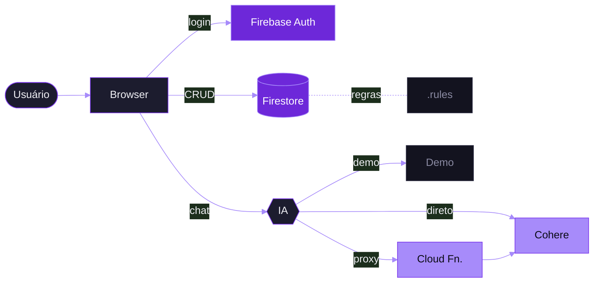

<div align="center">


<a href="https://monitoramento-de-gastos.web.app/">
  
</a>

<br /><br />

[](https://monitoramento-de-gastos.web.app/)
[](#)

[](#)
[](#)
[](#)
[](#)
[](#)

### [→ Abrir aplicação](https://monitoramento-de-gastos.web.app/)

</div>

---

## Destaques

- **Assistente de IA integrado** — análise de gastos via Cohere, com modo demo embutido e suporte a Cloud Function para proteger a chave.
- **Segurança de produção** — CSP restritivo, HSTS, `Permissions-Policy` e regras Firestore com whitelist de campos, tipos validados e proteção contra transferência de ownership.
- **UX cuidada** — tela de login com ticker em movimento, logo com pulso animado, modal acessível (armadilha de foco), toasts, date picker customizado e banner offline.
- **Tema claro/escuro** — paleta adaptável, troca suave, preferência persistida.
- **Responsivo** — do desktop ao mobile sem framework de UI.
- **Zero build step** — HTML, CSS e JavaScript (ES modules) puros; deploy direto no Firebase Hosting.

---

## Como funciona



### Modelo de dados

Coleção `despesas` — um documento por lançamento.

| Campo | Tipo | Regra |
|---|---|---|
| `tipo` | string | `entrada` ou `saida` |
| `descricao` | string | 1–100 caracteres, não apenas espaços em branco |
| `categoria` | string | whitelist por tipo (ver tabela abaixo) |
| `valor` | number | `> 0` e `≤ 9.999.999,99` |
| `userId` | string | igual a `request.auth.uid`, imutável em updates |
| `pago` | bool | — |
| `dataCriacao` | timestamp | — |

**Saída:** Contas Fixas · Alimentação · Transporte · Educação · Saúde · Outros
**Entrada:** Salário · Freelance · Investimentos · Vendas · Outros

---

## Stack

<p align="center">
  <a href="https://skillicons.dev">
    
  </a>
</p>

| Camada | Tecnologia | Por quê |
|---|---|---|
| UI | HTML5, CSS3, JavaScript (ES modules) | Zero build, deploy trivial, controle total da UX |
| Autenticação | Firebase Authentication | Login por e-mail/senha e Google sem backend próprio |
| Banco | Cloud Firestore | Tempo real, regras declarativas, escalável sem servidor |
| Hosting | Firebase Hosting | CDN com headers de segurança configurados via `firebase.json` |
| IA | Cohere Chat API | Respostas em PT-BR, integração HTTP direta, custo previsível |

---

## Segurança

A camada de segurança foi estruturada em três frentes, não apenas "tem login".

**Headers HTTP** — definidos em `firebase.json`
- `Content-Security-Policy` restrito a origens conhecidas (Firebase, Cohere, reCAPTCHA).
- `Strict-Transport-Security` com `preload`.
- `X-Content-Type-Options: nosniff` e `X-Frame-Options: SAMEORIGIN`.
- `Permissions-Policy` bloqueia câmera, microfone, geolocalização e pagamento.

**Regras Firestore** — definidas em `firestore.rules`
- Leitura, edição e exclusão apenas pelo dono (`request.auth.uid == resource.data.userId`).
- `hasAll` + `hasOnly` garantem exatamente os campos esperados — nenhum extra passa.
- Tipos validados por campo, incluindo `timestamp` para `dataCriacao`.
- `userId` imutável em updates: impossível transferir um documento para outro usuário.
- Categorias são whitelists separadas para entrada e saída.
- `valor > 0 && valor ≤ 9.999.999,99` bloqueia negativos e estouros.

**Chave da Cohere**
- *Demo* — chave ausente, a UI mostra mensagem explicativa.
- *Local* — `COHERE_API_KEY` no cliente, apenas para desenvolvimento.
- *Produção* — `USA_CLOUD_FUNCTION = true`, a chave fica no backend e o cliente nunca a vê.

---

## Rodando localmente

**Pré-requisitos**
- [Node.js](https://nodejs.org/)
- [Firebase CLI](https://firebase.google.com/docs/cli)

```bash
git clone https://github.com/carloshjes/gastos-mensais.git
cd gastos-mensais
npm install -g firebase-tools
firebase login
firebase serve
```

<details>
<summary><strong>Configurando um Firebase próprio</strong></summary>

<br />

1. Crie um projeto em [console.firebase.google.com](https://console.firebase.google.com).
2. Ative **Authentication** (E-mail/Senha e Google) e **Cloud Firestore**.
3. Substitua o objeto `firebaseConfig` no topo de `public/app.js`.
4. Ajuste `.firebaserc` para o seu `projectId`.
5. Publique as regras:
   ```bash
   firebase deploy --only firestore:rules
   ```

</details>

<details>
<summary><strong>Ativando o assistente de IA</strong></summary>

<br />

**Opção A — chave direto no cliente** (apenas para uso local)

```js
// public/app.js
const COHERE_API_KEY = "sua-chave-aqui";
```

**Opção B — via Cloud Function** (recomendado para produção)

```js
// public/app.js
const USA_CLOUD_FUNCTION = true;
const URL_CLOUD_FUNCTION = 'https://<region>-<projectId>.cloudfunctions.net/chatIA';
```

Na opção B, a chave permanece no backend e o cliente nunca tem acesso.

</details>

---

## Estrutura

```
gastos-mensais/
├── public/
│   ├── index.html      # marcação, telas de login e app
│   ├── style.css       # tema, animações, responsividade
│   ├── app.js          # lógica, Firebase SDK, IA, estado
│   └── 404.html        # fallback de rota
├── firebase.json       # hosting + headers de segurança
├── firestore.rules     # regras de acesso e validação
└── .firebaserc         # projectId
```

---

## Autor

Desenvolvido por **Carlos Henrique** — [@carloshjes](https://github.com/carloshjes)
