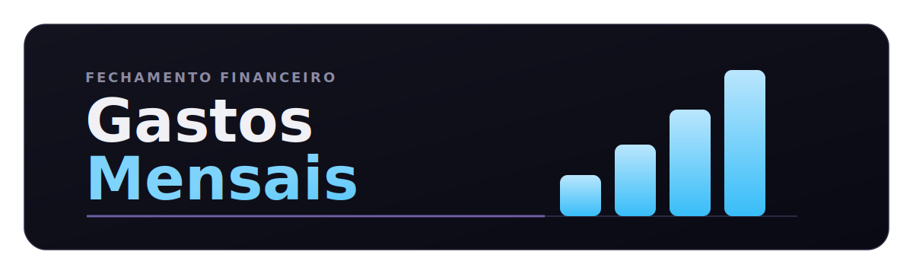

<p align="center">
  
</p>

<p align="center">
  <strong>Painel de finanças pessoais 100% front-end.</strong><br>
  Firebase Auth e Firestore em tempo real, categorias por tipo, radar de distribuição e um chat opcional com IA.
</p>

<p align="center">
  <a href="https://monitoramento-de-gastos.web.app/"><strong>Abrir aplicação</strong></a>
  ·
  <a href="#rodando-localmente"><strong>Rodar localmente</strong></a>
  ·
  <a href="#como-funciona"><strong>Arquitetura</strong></a>
  ·
  <a href="#seguran%C3%A7a"><strong>Segurança</strong></a>
</p>

<p align="center">
  <a href="https://monitoramento-de-gastos.web.app/">
    
  </a>
  
  
</p>

## Destaques

- **Fechamento do período em um painel.** Receitas, despesas, saldo líquido e uso da receita lado a lado, com filtro por mês.
- **Categorias com significado.** 6 categorias de despesa e 5 de receita, radar de distribuição e destaque da categoria líder do período.
- **Lançamentos sem ruído.** Cadastro, edição, busca por descrição/categoria/valor e conferência rápida em tabela.
- **Chat com IA opcional (demo).** Traga sua chave Cohere, teste o assistente com o contexto real dos seus lançamentos e remova quando quiser.
- **Tema claro e escuro** com paleta consistente e transições suaves.
- **Segurança distribuída.** CSP restritivo, App Check e regras Firestore validando tipos, campos e titularidade.

> Sem framework de UI. Sem etapa de build. Deploy direto no Firebase Hosting.

## Stack

| Camada | Tecnologia | Papel no projeto |
|---|---|---|
| UI | HTML5, CSS3, JavaScript (ES modules) | Interface, interações, responsividade e tema claro/escuro — sem build |
| Autenticação | Firebase Authentication | Login por e-mail/senha e Google |
| Banco | Cloud Firestore | Persistência em tempo real com regras declarativas |
| Hosting | Firebase Hosting | Deploy estático com headers de segurança configurados |
| Gráficos | Chart.js | Radar de categorias e visualizações do fechamento |
| IA (opcional) | Cohere Chat API | Respostas em PT-BR com contexto financeiro — modo demo por padrão |

## Rodando localmente

**Pré-requisitos**
- [Node.js](https://nodejs.org/)
- [Firebase CLI](https://firebase.google.com/docs/cli)

```bash
git clone https://github.com/carloshjes/gastos-mensais.git
cd gastos-mensais
npm install -g firebase-tools
firebase login
firebase serve
```

Depois do `firebase serve`, abra a URL local informada pela CLI.

## Como funciona

Um ciclo curto de leitura financeira em quatro passos.

<p align="center">
  <strong>Entrar</strong> → <strong>Registrar</strong> → <strong>Consolidar</strong> → <strong>Consultar IA</strong>
</p>

**1. Entrar** — Sessão validada por `Firebase Authentication` (e-mail/senha ou Google).

**2. Registrar** — Lançamentos gravados na coleção `despesas` do `Cloud Firestore`, em tempo real.

**3. Consolidar** — O front transforma os lançamentos em resumo, radar de categorias e status do período selecionado.

**4. Consultar IA (opcional)** — Com uma chave Cohere, o app monta o contexto financeiro e envia ao chat. Sem chave, o assistente responde em modo demo.

<details>
<summary><strong>Modelo de dados</strong></summary>

<br />

Coleção `despesas` — um documento por lançamento.

| Campo | Tipo | Regra |
|---|---|---|
| `tipo` | string | `entrada` ou `saida` |
| `descricao` | string | 1–100 caracteres, não apenas espaços em branco |
| `categoria` | string | lista permitida por tipo |
| `valor` | number | `> 0` e `≤ 9.999.999,99` |
| `userId` | string | igual a `request.auth.uid`, imutável em updates |
| `pago` | bool | opcional |
| `dataCriacao` | timestamp | data do lançamento |

**Categorias de saída:** Contas Fixas · Alimentação · Transporte · Educação · Saúde · Outros  
**Categorias de entrada:** Salário · Freelance · Investimentos · Vendas · Outros

</details>

## Segurança

A proteção está distribuída em três camadas: o que trafega, o que é gravado, e o que a IA consome.

### Rede — headers em `firebase.json`
- `Content-Security-Policy` restrito a origens conhecidas (Firebase, Cohere, reCAPTCHA).
- `Strict-Transport-Security` com `preload`.
- `X-Content-Type-Options: nosniff` e `X-Frame-Options: SAMEORIGIN`.
- `Permissions-Policy` bloqueando câmera, microfone, geolocalização e pagamento.

### Dados — regras em `firestore.rules`
- Leitura, edição e exclusão apenas pelo dono do documento.
- Validação de campos com `hasAll` e `hasOnly`, checagem de tipos por campo (incluindo `timestamp`).
- `userId` imutável em updates — bloqueia troca de titularidade.
- Lista de categorias validada por tipo e `valor > 0 && valor ≤ 9.999.999,99`.

### IA — por design, sem chave no repositório
- Nenhuma chave Cohere é distribuída no código.
- Sem chave, o chat roda em **modo demo** com respostas de exemplo.
- Para experimentar com a Cohere real, a chave é configurada localmente e removida depois.

## Configuração opcional

<details>
<summary><strong>Configurar um Firebase próprio</strong></summary>

<br />

1. Crie um projeto em [console.firebase.google.com](https://console.firebase.google.com).
2. Ative **Authentication** com E-mail/Senha e Google.
3. Ative **Cloud Firestore**.
4. Substitua o objeto `firebaseConfig` no topo de `public/app.js`.
5. Ajuste `.firebaserc` para o seu `projectId`.
6. Publique as regras:

```bash
firebase deploy --only firestore:rules
```

</details>

<details>
<summary><strong>Ativar o assistente de IA (demo)</strong></summary>

<br />

O chat de finanças é um experimento com a API da Cohere. O projeto **não embarca chave** — o comportamento padrão é o modo demo.

Para testar com uma chave real, abra `public/app.js` e escolha uma das duas opções.

**Opção A — chave no cliente (só local)**

```js
const COHERE_API_KEY = "sua-chave-aqui";
```

Use apenas para experimentação local e **remova antes de publicar**.

**Opção B — via Cloud Function (chave no backend)**

```js
const USA_CLOUD_FUNCTION = true;
const URL_CLOUD_FUNCTION = 'https://<region>-<projectId>.cloudfunctions.net/chatIA';
```

Nesta rota, a chave fica no servidor e o cliente nunca tem acesso.

Sem nenhuma das duas, o chat continua rodando em modo demo.

</details>

## Estrutura do projeto

```text
gastos-mensais/
|-- public/
|   |-- index.html      # marcação, tela de login e dashboard
|   |-- style.css       # tema, animações e responsividade
|   |-- app.js          # lógica da aplicação, Firebase SDK e IA
|   `-- 404.html        # fallback de rota
|-- docs/
|   |-- chart.svg       # ícone animado usado em peças auxiliares
|   |-- header.svg      # cabeçalho principal do README
|   `-- title.svg       # wordmark em versão standalone
|-- firebase.json       # hosting + headers de segurança
|-- firestore.rules     # regras de acesso e validação
`-- .firebaserc         # projectId
```

## Autor

Desenvolvido por **Carlos Henrique** — [@carloshjes](https://github.com/carloshjes)
