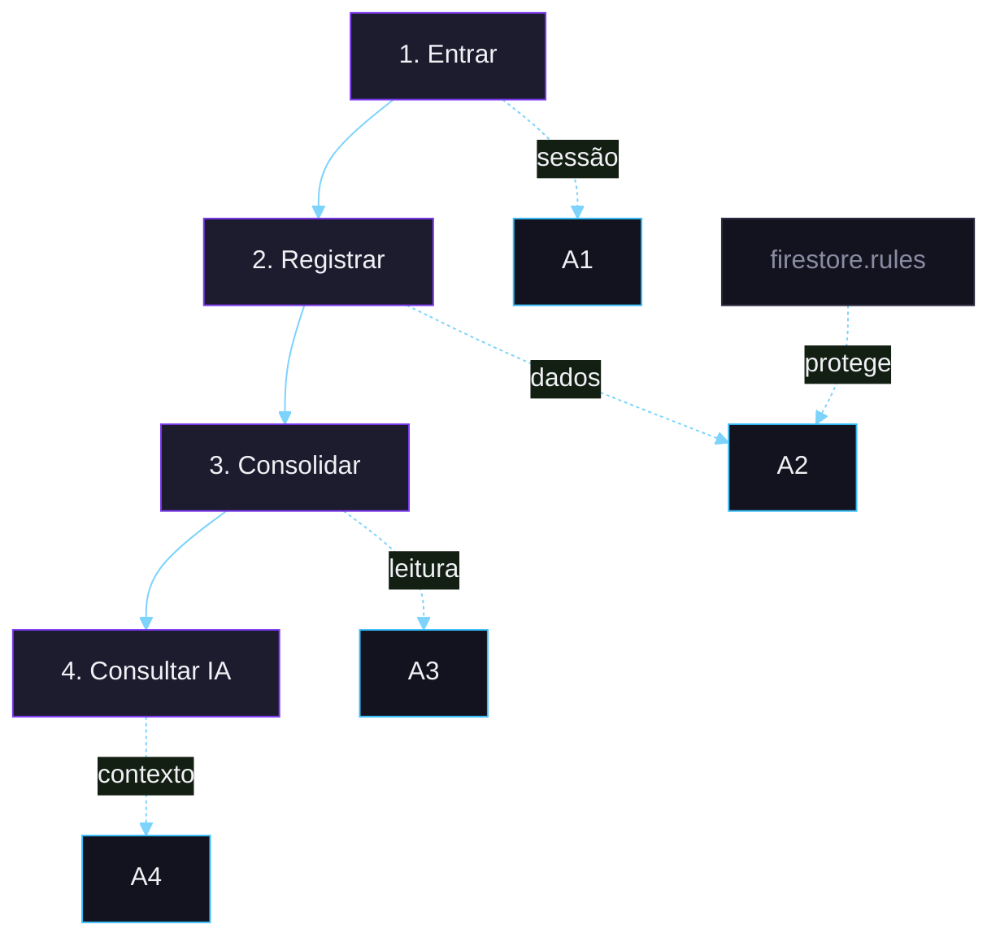

<p align="center">
  
</p>

<p align="center">
  Monitoramento de finanças pessoais com <strong>dashboard em tempo real</strong>,
  <strong>categorias por tipo</strong> e <strong>assistente financeiro com IA</strong>.
</p>

<p align="center">
  Projeto front-end puro com <strong>Firebase Authentication</strong>, <strong>Cloud Firestore</strong>,
  <strong>Firebase Hosting</strong> e integração com <strong>Cohere</strong>.
</p>

<p align="center">
  <a href="https://monitoramento-de-gastos.web.app/"><strong>Abrir aplicação</strong></a>
  ·
  <a href="#rodando-localmente"><strong>Rodar localmente</strong></a>
  ·
  <a href="#como-funciona"><strong>Ver arquitetura</strong></a>
  ·
  <a href="#segurança"><strong>Ver segurança</strong></a>
</p>

<p align="center">
  <a href="https://monitoramento-de-gastos.web.app/">
    
  </a>
  
</p>

<p align="center">
  
  
  
  
  
</p>

## Visão rápida

<table>
  <tr>
    <td width="50%" valign="top">
      <strong>Resumo financeiro claro</strong><br>
      Receitas, despesas, saldo líquido e uso da receita no mesmo painel, com leitura rápida do período.
    </td>
    <td width="50%" valign="top">
      <strong>Lançamentos com contexto</strong><br>
      Cadastro, edição, busca e filtro mensal com categorias separadas para entradas e saídas.
    </td>
  </tr>
  <tr>
    <td width="50%" valign="top">
      <strong>Assistente financeiro com IA</strong><br>
      Chat com contexto real dos lançamentos, modo demo embutido e suporte a Cloud Function para proteger a chave.
    </td>
    <td width="50%" valign="top">
      <strong>Segurança pensada para produção</strong><br>
      CSP restritivo, App Check e regras Firestore com whitelist de campos e proteção contra troca de ownership.
    </td>
  </tr>
</table>

> Sem framework de UI, sem etapa de build e com deploy direto no Firebase Hosting.

## Stack

<p align="center">
  <a href="https://skillicons.dev">
    
  </a>
</p>

| Camada | Tecnologia | Papel no projeto |
|---|---|---|
| UI | HTML5, CSS3, JavaScript (ES modules) | Interface, interações, responsividade e camada visual sem build step |
| Autenticação | Firebase Authentication | Login por e-mail/senha e Google |
| Banco | Cloud Firestore | Persistência em tempo real com regras declarativas |
| Hosting | Firebase Hosting | Deploy estático com headers de segurança configurados |
| IA | Cohere Chat API | Respostas em PT-BR com contexto financeiro do usuário |

## Rodando localmente

**Pré-requisitos**
- [Node.js](https://nodejs.org/)
- [Firebase CLI](https://firebase.google.com/docs/cli)

```bash
git clone https://github.com/carloshjes/gastos-mensais.git
cd gastos-mensais
npm install -g firebase-tools
firebase login
firebase serve
```

Depois do `firebase serve`, abra a URL local informada pela CLI para testar a aplicação.

## Como funciona

A experiência se organiza em um ciclo curto de leitura financeira: autenticar, registrar, consolidar e consultar.

<p align="center">
  <strong>Entrar</strong> → <strong>Registrar</strong> → <strong>Consolidar</strong> → <strong>Consultar IA</strong>
</p>

**1. Entrar**  
Você abre o fechamento financeiro com login protegido.  
`Firebase Authentication` valida a sessão e identifica o usuário.

**2. Registrar**  
Você cria, edita e consulta receitas e despesas do período.  
`Cloud Firestore` lê e grava a coleção `despesas` em tempo real.

**3. Consolidar**  
O dashboard recalcula saldo, categorias, gráficos e filtro mensal.  
O front transforma os lançamentos em leitura prática para o período atual.

**4. Consultar IA**  
Você pede análise do saldo, padrões de gasto e próximos ajustes.  
O app monta o contexto financeiro e consulta `Cohere`, direto ou via `Cloud Function`.

<details>
<summary><strong>Ver diagrama técnico compacto</strong></summary>

<br />



</details>

<details>
<summary><strong>Modelo de dados</strong></summary>

<br />

Coleção `despesas` — um documento por lançamento.

| Campo | Tipo | Regra |
|---|---|---|
| `tipo` | string | `entrada` ou `saida` |
| `descricao` | string | 1-100 caracteres, não apenas espaços em branco |
| `categoria` | string | whitelist por tipo |
| `valor` | number | `> 0` e `≤ 9.999.999,99` |
| `userId` | string | igual a `request.auth.uid`, imutável em updates |
| `pago` | bool | opcional |
| `dataCriacao` | timestamp | data do lançamento |

**Categorias de saída:** Contas Fixas · Alimentação · Transporte · Educação · Saúde · Outros

**Categorias de entrada:** Salário · Freelance · Investimentos · Vendas · Outros

</details>

## Segurança

Este projeto não depende só de autenticação. A proteção está distribuída entre front-end, Firebase e regras de acesso.

**Headers HTTP em `firebase.json`**
- `Content-Security-Policy` restrito a origens conhecidas, incluindo Firebase, Cohere e reCAPTCHA.
- `Strict-Transport-Security` com `preload`.
- `X-Content-Type-Options: nosniff` e `X-Frame-Options: SAMEORIGIN`.
- `Permissions-Policy` bloqueando câmera, microfone, geolocalização e pagamento.

**Proteção do Firestore em `firestore.rules`**
- leitura, edição e exclusão apenas pelo dono do documento;
- validação de campos com `hasAll` e `hasOnly`;
- checagem de tipos por campo, incluindo `timestamp`;
- bloqueio de mudança de `userId` durante updates;
- whitelist de categorias separada para entradas e saídas;
- validação de `valor > 0 && valor ≤ 9.999.999,99`.

**Camada de IA**
- modo demo quando a chave não está presente;
- chave direta no cliente apenas para uso local;
- uso via Cloud Function em produção para esconder a credencial.

## Configuração opcional

<details>
<summary><strong>Configurar um Firebase próprio</strong></summary>

<br />

1. Crie um projeto em [console.firebase.google.com](https://console.firebase.google.com).
2. Ative **Authentication** com E-mail/Senha e Google.
3. Ative **Cloud Firestore**.
4. Substitua o objeto `firebaseConfig` no topo de `public/app.js`.
5. Ajuste `.firebaserc` para o seu `projectId`.
6. Publique as regras:

```bash
firebase deploy --only firestore:rules
```

</details>

<details>
<summary><strong>Ativar o assistente de IA</strong></summary>

<br />

**Opção A — chave direto no cliente**  
Indicada apenas para desenvolvimento local.

```js
// public/app.js
const COHERE_API_KEY = "sua-chave-aqui";
```

**Opção B — via Cloud Function**  
Recomendada para produção.

```js
// public/app.js
const USA_CLOUD_FUNCTION = true;
const URL_CLOUD_FUNCTION = 'https://<region>-<projectId>.cloudfunctions.net/chatIA';
```

Na opção B, a chave permanece no backend e o cliente nunca tem acesso.

</details>

## Estrutura do projeto

```text
gastos-mensais/
|-- public/
|   |-- index.html      # marcação, tela de login e dashboard
|   |-- style.css       # tema, animações e responsividade
|   |-- app.js          # lógica da aplicação, Firebase SDK e IA
|   `-- 404.html        # fallback de rota
|-- docs/
|   |-- chart.svg       # ícone animado usado em peças auxiliares
|   |-- header.svg      # cabeçalho principal do README
|   `-- title.svg       # wordmark em versão standalone
|-- firebase.json       # hosting + headers de segurança
|-- firestore.rules     # regras de acesso e validação
`-- .firebaserc         # projectId
```

## Autor

Desenvolvido por **Carlos Henrique** — [@carloshjes](https://github.com/carloshjes)
